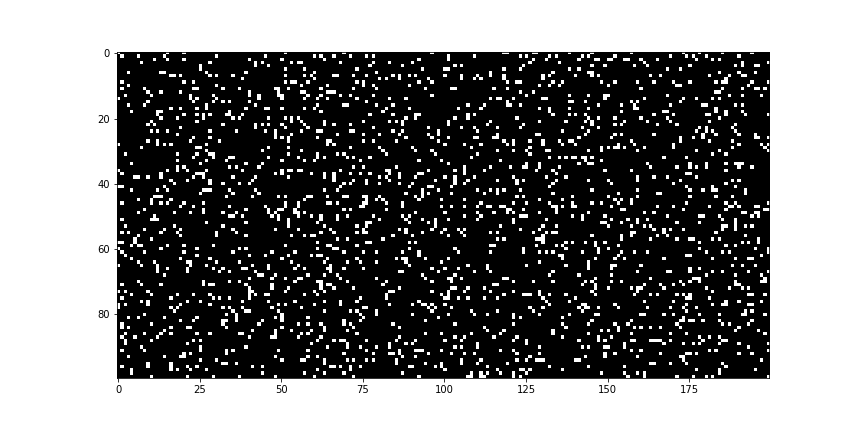
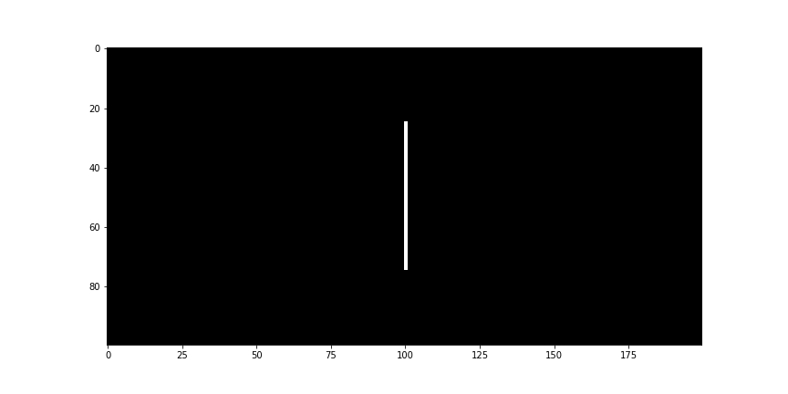

## A python implementation of Conways Game of Life.

John Conways [game of life](https://en.wikipedia.org/wiki/Conway%27s_Game_of_Life) is a 'cellular automaton', where cells live in a 2D-grid. For every time-step taken, a simple set of rules determines if a cell lives or dies in the next timestep. The rules are:

1. **Overpopulation**. Each cell with more than three neighbours dies.
2. **Underpopulation**. Each cell with less than two neighbours dies.
3. **Survival**. Each live cell with two or three neighbours survives.
3. **Reproduction**. Each dead cell with exactly three neighbours becomes alive.

Following these rules, a randomly populated grid will show some interesting behaviour:

A simple line on the grid will develop into a mesmerizing pattern:

### Getting started with this repo

Clone the repository by unzipping or:

`git clone https://github.com/DanielDondorp/GameOfLife.git`

In your preferred python environment, install the dependencies

`pip -r install requirements.txt`

###### Other dependencies
For saving gifs of the simulations, [imagemagick](https://imagemagick.org/) is used. On ubuntu this can be installed with apt (`apt-get install imagemagick`), or follow the instructions on the imagemagick website.

###### To Do:
1. write setup.py
2. write class that can be used easily outside of jupyter notebook
3. create small interactive application where users can draw or define startconditions (Either using streamlit or Qt5)
